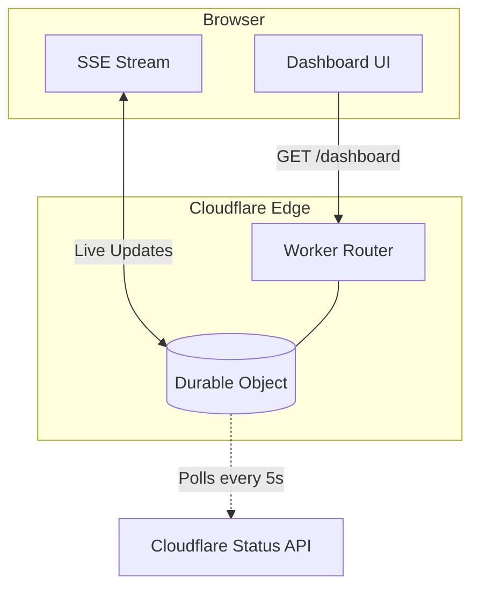

# 🚦 monitor-wr — Waiting Room Live Monitor

A self-hosted, faster-updating dashboard for Cloudflare Waiting Rooms. Deploys entirely on **Cloudflare Workers + Durable Objects** — no external infrastructure needed.

> [!IMPORTANT]
> **Why this exists:** The Cloudflare dashboard refreshes Waiting Room metrics on a ~60s UI cycle, on top of a ~20–50s API cache. This tool cuts that lag to ~55s by polling the Status API directly and pushing updates via Server-Sent Events (SSE).

---

## ✨ Features

* **⚡ Faster Updates** — Picks up Status API cache refreshes within 5 seconds and pushes to your browser immediately.
* **📈 30-Minute Rolling Chart** — History is stored in Durable Object storage; the chart is populated instantly even if you just opened the tab.
* **🛡️ Glitch Filtering** — Automatically ignores transient "zero" values from the API to prevent false drops on your charts.
* **🌊 Smooth Lines** — Uses Exponential Moving Average (EMA) to smooth out the "steppy" nature of the API cache.
* **🔄 SSE Fallback** — Automatically falls back to polling if the live connection is interrupted.
* **🔐 Zero Trust Ready** — Designed to be wrapped with Cloudflare Access for identity-based security.

---

## ⚙️ How It Works



* **Worker:** Serves the HTML/JS dashboard and routes requests.
* **Durable Object:** The single source of truth. It polls the API only when a user is connected (cost-efficient) and broadcasts to all tabs simultaneously.

---

## ⏱️ Data Freshness

| Tool | Average Lag | Max Observed Lag |
| :--- | :--- | :--- |
| **Cloudflare Dashboard** | ~80s | ~110s |
| **monitor-wr** | **~35s** | **~55s** |

> [!NOTE]
> Polling faster than 5s is possible but unnecessary; the underlying Cloudflare API cache typically only refreshes every 20–30s.

---

## 🚀 Setup Guide

### 1. Initialize Project
```bash
npx wrangler@latest init wr-live-monitor
# Select 'No' for TypeScript, 'Yes' to creating a Worker
cd wr-live-monitor
```

### 2. Configure `wrangler.toml`
Replace the content of your `wrangler.toml` with this:

```toml
name = "wr-monitor"
main = "src/index.js"
compatibility_date = "2025-01-01"

[durable_objects]
bindings = [
  { name = "WR_MONITOR", class_name = "WRMonitorDO" }
]

[[migrations]]
tag = "v1"
new_sqlite_classes = ["WRMonitorDO"]

[vars]
ZONE_ID = "YOUR_ZONE_ID"
WR_ID   = "YOUR_WAITING_ROOM_ID"
# DASH_KEY = "optional-secret-key"
```

### 3. Set Credentials
Create an API Token with **Waiting Room: Read** permissions.

```bash
# Set your API Token
wrangler secret put CF_API_TOKEN

# Find your Waiting Room ID if you don't have it:
curl "[https://api.cloudflare.com/client/v4/zones/$ZONE_ID/waiting_rooms](https://api.cloudflare.com/client/v4/zones/$ZONE_ID/waiting_rooms)" \
  -H "Authorization: Bearer YOUR_TOKEN"
```

### 4. Deploy
```bash
wrangler deploy
```

---

## 🔒 Security Options

### Option A: Query Key (Basic)
Set `DASH_KEY` in your `vars`. The dashboard will only load if you append `?k=YOUR_KEY` to the URL. Use this for quick, private links.

### Option B: Cloudflare Access (Recommended)
1. Navigate to **Zero Trust** > **Access** > **Applications**.
2. Add a **Self-hosted** application pointing to your Worker URL.
3. Assign an **Allow** policy for your team's emails.


---

## 🖼️ Dashboard Preview


---

## ⚠️ Limitations

* **Estimates Only:** The Status API provides probabilistic aggregations, not 1:1 real-time counters.
* **Queue All Mode:** When "Queue All" is active, `active_users` may trend toward zero as traffic isn't reaching the origin.
* **Single Room:** Each deployment monitors one `WR_ID`. For multiple rooms, deploy multiple workers.

---

**Disclaimer:** *THIS SOFTWARE IS PROVIDED AS-IS. CLOUDFLARE IS NOT LIABLE FOR ANY DIRECT, INDIRECT, INCIDENTAL, OR CONSEQUENTIAL DAMAGES ARISING FROM ITS USE.*

---

Would you like me to generate the **`src/index.js`** code for you so you can copy it straight into your project?
